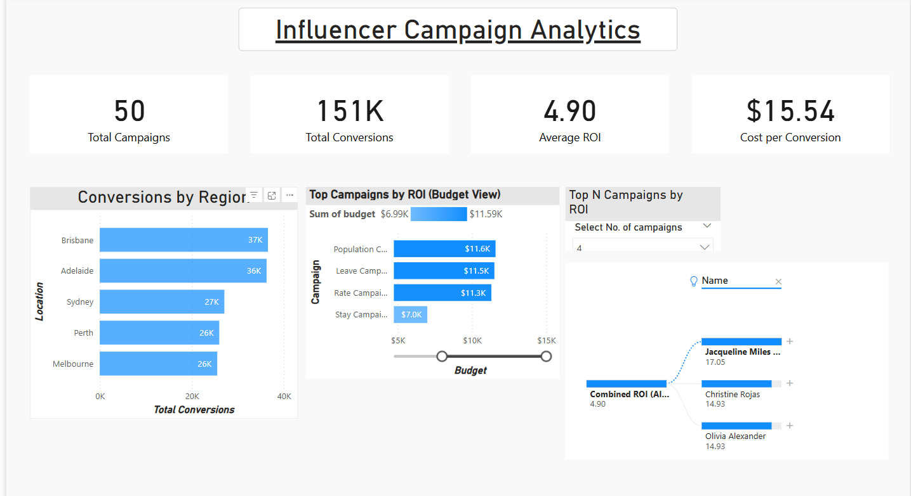
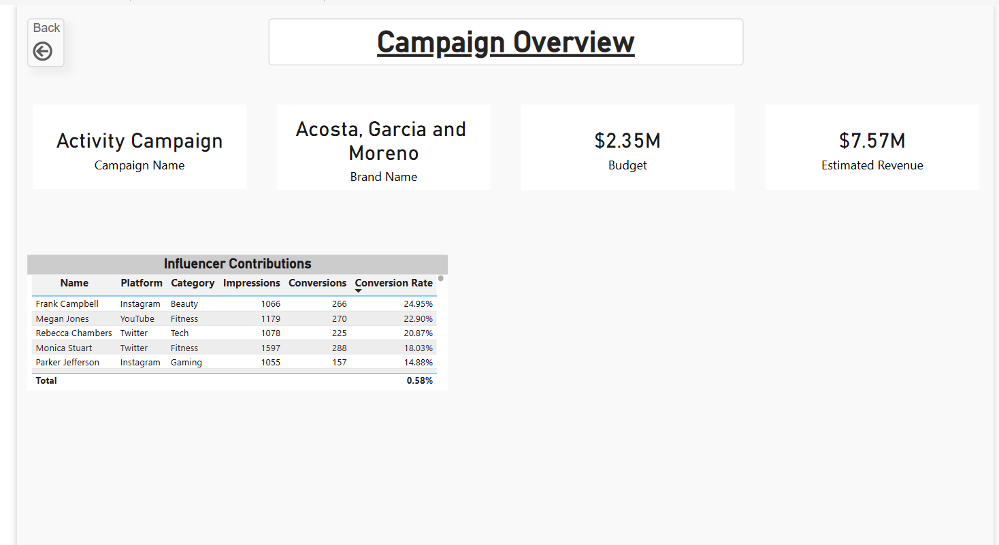
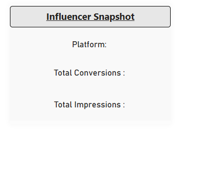

# 📊 Tecron: Influencer Campaign Analytics 
*Driving Smarter Brand Decisions with Data*

This Power BI dashboard project analyzes influencer marketing campaign data to uncover strategic insights across campaign performance, platform effectiveness, and budget efficiency. Built with industry practices in mind, it focuses on delivering insights for marketing, finance, and sales personas.  
> 🎯 Work in Progress – visuals are functional, SQL-backed modeling and tooltip interactions are underway.

## 🧭 Objectives  
- Visualize campaign ROI, cost per conversion, and platform-level performance  
- Identify top-performing influencer campaigns using dynamic Top N filters  
- Support strategic decisions through region-based conversion trends and ROI analysis  
- Integrate SQL-based data views to simulate enterprise-level workflows  
- Deliver insights in a way that aligns with stakeholder needs and business KPIs

## 🧰 Tools Used  
- Power BI (DAX, Slicers, Bookmarks, Tooltips)  
- SQL (Views, Data Modeling, Query Optimization)  
- Excel (Data Cleaning, VLOOKUP, Macros)  
- Draw.io (ERD and schema design)  
- SQLite Browser (for local database testing)

## ✅ Key Features  
- **Home Page**: KPIs (Total Campaigns, Avg ROI, Cost per Conversion), Region-wise conversions, ROI vs Budget  
- **Campaign Overview**: Campaign-specific insights with influencer-level contribution metrics  
- **Top N Slicer**: Dynamic campaign filtering by ROI  
- **Tooltip Card**: Hover-based influencer snapshot  
- **Tecron Branding**: Custom styling to simulate real company scenario  
- **SQL Integration**: Database file and custom views stored in `/sql` folder

## 📁 Repository Structure  
📁 data/ — Raw and cleaned influencer data  
📁 screenshots/ — Dashboard mockups and visuals  
📁 sql/ — SQL views, DB schema file, and query logic  
📁 dashboard/ — Power BI .pbix file  
📄 README.md — This file

## 📸 Current Previews  

## ⚠️ Data Challenges Encountered
During the data merging process, I discovered that 9 influencer IDs from the master profile list had no matching records in the engagement data. This could represent inactive, new, or incorrectly entered influencers.

### ✅ Resolution
To maintain data completeness, I used a **Left Outer Join** to keep all influencer profiles. Missing values are displayed as blanks or “No data available” in visuals and excluded from aggregated KPIs to avoid skewed insights.

This decision simulates real-world handling of incomplete or messy data — and reinforces data integrity while communicating uncertainty where needed.

## 🔧 Data Modeling Decisions

To enrich regional segmentation, I connected the `region_campaign` table (aggregated region-level campaign stats) with the `influencer_summary` table using `location` as the shared key. This allowed seamless cross-filtering between campaign and influencer metrics based on geography. As a result, users can filter and explore KPIs, charts, and influencer performance by region — enabling more contextual, business-relevant insights.

## 🚧 What's Next  
- Complete Finance persona insights and cost-efficiency views  
- Finalize bookmark navigation and tooltip UX  
- Document SQL data model (ERD + schema logic)  
- Publish to Power BI Service and embed view  
- Upload walkthrough slides as PDF in `/docs` folder

## 💼 Author  
**Sai Praveen Kallepalli**  
[LinkedIn](https://www.linkedin.com/in/sai-kallepalli/)  
📧 saipraveen98@outlook.com
